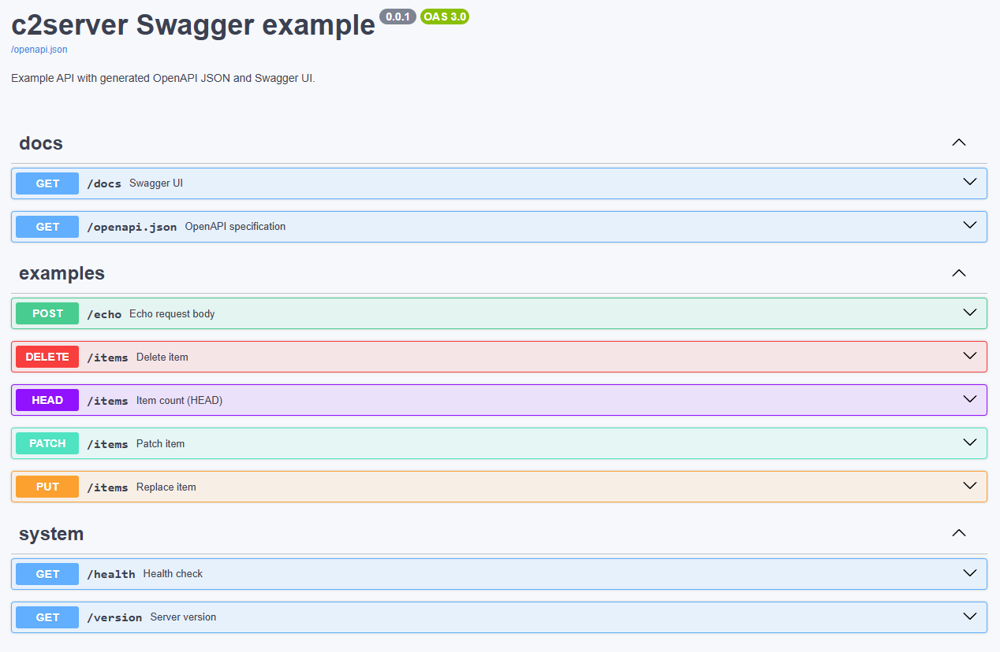

# c2server

C++23 HTTP and HTTPS server library built on Boost.Asio and Boost.Beast.

Features:

- route handlers and Express-style middleware
- generated OpenAPI JSON and Swagger UI endpoints
- CORS, request IDs, security headers, access logs, and rate limiting
- JSON configuration
- graceful shutdown
- synchronous HTTP and HTTPS client
- public C++ modules

## Architecture

The library is structured as a set of independent C++23 modules that compose around a shared `Router`:

```
┌─────────────────────────────────────────────┐
│                  c2server::Server           │
│  (Boost.Asio acceptor + Beast session loop) │
└────────────────────┬────────────────────────┘
                     │ HttpRequest
                     ▼
┌─────────────────────────────────────────────┐
│                 c2server::Router            │
│                                             │
│  Middleware chain (applied in order):       │
│    requestId → accessLog → securityHeaders  │
│    → cors → rateLimit → …                   │
│                                             │
│  Endpoint dispatch (first match wins):      │
│    RouteEndpoint  ·  custom EndpointBase    │
└─────────────────────────────────────────────┘
```

**Server** — `c2server::Server` wraps a Boost.Asio `io_context` and a Beast HTTP/HTTPS acceptor. Each accepted
connection gets its own session that reads one request, routes it through the `Router`, and writes the response.
`workerThreads` controls the thread-pool size; zero selects one thread per hardware core. TLS is handled by an
`ssl::context` built from `SslSettings`; plain HTTP is accepted alongside HTTPS when `allowPlainHttp` is set.

**Router** — holds an ordered list of `Middleware` functions and `EndpointBase` instances. On each request the
middleware chain is traversed first; each middleware may short-circuit or call `next`. Afterwards the first
`EndpointBase::matches()` that returns `true` handles the request. `RouteEndpoint` (returned by `get`, `post`,
`put`, `patch`, `delete_`, `head`, `options`) does exact method + path matching. Custom endpoints can be added via
`addEndpoint`. The router is frozen on `Server` construction and rejects further changes.

**OpenAPI generation** — every `RouteEndpoint` carries an optional `RouteDoc` (summary, description, tags,
`RequestBodyDoc`, `ResponseDoc` list). `Router::openApiJson()` walks the registered routes and emits an OpenAPI 3.0
JSON document. `Router::serveOpenApi()` registers two extra routes that serve that document and a Swagger UI page.

**Middleware** — each middleware is a `std::function<HttpResponse(const HttpRequest&, Next)>` where `Next` is a
callable that forwards to the rest of the chain. The built-in middleware are:

| Middleware | What it does |
| --- | --- |
| `requestId()` | Attaches a UUID to every request in `X-Request-ID`. |
| `accessLog()` | Logs method, path, status, and latency via spdlog. |
| `securityHeaders()` | Adds `X-Frame-Options`, `X-Content-Type-Options`, `Strict-Transport-Security`, etc. |
| `cors(CorsOptions)` | Handles preflight and attaches `Access-Control-*` headers. |
| `rateLimit(RateLimitOptions)` | Per-IP sliding-window counter; returns 429 when exceeded. |

**Client** — `c2server::Client` is a synchronous Boost.Beast HTTP client that shares the same `HttpRequest` /
`HttpResponse` types as the server. It supports plain HTTP and TLS.

**PayloadStore** — a mutex-guarded `std::string` with `get()` / `set()` for sharing mutable state across handlers
without external synchronization.

## Swagger UI

`serveOpenApi()` inspects all registered `RouteDoc` metadata and generates a live OpenAPI 3.0 document. Swagger UI
is served from the same process — no separate documentation server required.



```c++
router->serveOpenApi({
   .info = {
      .title       = "My API",
      .version     = std::string{c2server::kVersion},
      .description = "Auto-generated from RouteDoc annotations.",
   },
   // defaults: specTarget = "/openapi.json", docsTarget = "/docs"
});
```

Each route contributes to the spec through its `RouteDoc`:

```c++
router->post(
    "/echo",
    [](const c2server::HttpRequest& req) { return c2server::ok(req.body, "text/plain"); },
    c2server::RouteDoc{
        .summary     = "Echo request body",
        .tags        = {"examples"},
        .requestBody = c2server::RequestBodyDoc{
            .description = "Text to echo back.",
            .contentType = "text/plain",
            .required    = true,
        },
        .responses = {{.status = 200, .description = "Echoed text", .contentType = "text/plain"}},
    });
```

## Requirements

- CMake 3.30 or newer
- a C++23 compiler with module dependency scanning
- standard library module support for `import std;`
- vcpkg manifest mode, or installed CMake packages for `boost-beast`, `nlohmann-json`, `openssl`, and `spdlog`

MSVC builds require a Visual Studio developer environment. Linux builds require a compiler and standard library
combination that supports C++23 modules and `import std;`.

## Build

With vcpkg:

```sh
cmake -B ./build \
  -DCMAKE_TOOLCHAIN_FILE=/path/to/vcpkg/scripts/buildsystems/vcpkg.cmake \
  -DC2SERVER_BUILD_EXAMPLES=ON \
  -DC2SERVER_BUILD_TESTS=ON \
  -DC2SERVER_BUILD_DOCS=OFF \
  -DC2SERVER_INSTALL=ON
cmake --build ./build --parallel
```

CMake options:

| Option | Default | Description |
| --- | --- | --- |
| `C2SERVER_BUILD_EXAMPLES` | `ON` | Build example executables. |
| `C2SERVER_BUILD_TESTS` | `ON` | Build Boost.UT tests. |
| `C2SERVER_BUILD_DOCS` | `ON` | Enable the `c2server_docs` target when Doxygen is available. |
| `C2SERVER_INSTALL` | `ON` | Enable install rules and package generation. |

Run tests:

```sh
ctest --test-dir ./build --output-on-failure
```

Generate API documentation:

```sh
cmake --build ./build --target c2server_docs
```

## Install

```sh
cmake --install ./build --prefix /desired/prefix
```

The install contains:

- `c2server::core` CMake target
- public `.cppm` module interfaces
- library
- HTML API documentation when `c2server_docs` was generated

## Consume Modules

Consumers must enable C++23 module scanning and `import std` before creating targets. The experimental gate must be set
before `project(...)`.

```cmake
cmake_minimum_required(VERSION 3.30)

set(CMAKE_EXPERIMENTAL_CXX_IMPORT_STD
    # CMake experimental feature gate for `import std`.
    # This UUID is defined by CMake, not c2server. It may change between
    # CMake releases. Use the value from Help/dev/experimental.rst in the
    # source tree for the CMake version used to configure the project.
    "d0edc3af-4c50-42ea-a356-e2862fe7a444"
    CACHE STRING "CMake experimental import std gate")

if(CMAKE_HOST_WIN32)
   set(CMAKE_CXX_FLAGS_INIT "/utf-8")
endif()

project(example LANGUAGES CXX)

find_package(c2server CONFIG REQUIRED)

add_executable(example main.cpp)
target_link_libraries(example PRIVATE c2server::core)
set_target_properties(
   example
   PROPERTIES CXX_STANDARD 23
              CXX_STANDARD_REQUIRED ON
              CXX_EXTENSIONS OFF
              CXX_SCAN_FOR_MODULES ON
              CXX_MODULE_STD ON)
```

Configure the consumer with the installation prefix:

```sh
cmake -B ./build \
  -DCMAKE_PREFIX_PATH=/desired/prefix \
  -DCMAKE_TOOLCHAIN_FILE=/path/to/vcpkg/scripts/buildsystems/vcpkg.cmake
cmake --build ./build --parallel
```

Public modules:

- `c2server.client`
- `c2server.config`
- `c2server.error`
- `c2server.http`
- `c2server.logger`
- `c2server.middleware`
- `c2server.payload`
- `c2server.router`
- `c2server.server`
- `c2server.version`

## Example

```c++
import c2server.config;
import c2server.http;
import c2server.middleware;
import c2server.router;
import c2server.server;
import c2server.version;
import std;

int main() {
   auto router = std::make_shared<c2server::Router>();

   router->use(c2server::middleware::requestId())
       .use(c2server::middleware::securityHeaders())
       .use(c2server::middleware::cors());

   router->get("/health", [](const c2server::HttpRequest&) {
      return c2server::jsonOk({{"status", "ok"}});
   }, {
      .summary = "Health check",
      .tags = {"system"},
      .responses = {{.status = 200, .description = "Service status", .contentType = "application/json"}},
   });

   router->serveOpenApi({
      .info = {
         .title = "Example API",
         .version = std::string{c2server::kVersion},
         .description = "Generated OpenAPI documentation.",
      },
   });

   c2server::Server{c2server::loadServerSettings("config.json"), router}.run();
}
```

Register routes and middleware before constructing `c2server::Server`. Server construction freezes the router.

`serveOpenApi()` registers:

- `/docs` for Swagger UI
- `/openapi.json` for the generated OpenAPI document

Both paths can be customized:

```c++
router->serveOpenApi({
   .info = {.title = "Example API", .version = "1.0.0"},
   .specTarget = "/api/openapi.json",
   .docsTarget = "/api/docs",
});
```

Examples load `config.json` from their working directory by default. Pass a custom path as the first argument:

```sh
./build/examples/swagger_example ./config/config.json
```
